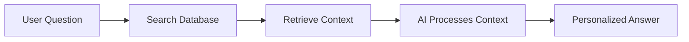

# 01 - Introduction and Architecture

This project is a smart anime recommendation engine. It doesn't just search for keywords; it understands what you are looking for by using artificial intelligence (AI).

## Project Goal
The goal is to give users high-quality anime suggestions based on their actual interests, while also having a strong system to test and measure how accurate those suggestions are.

## How it Works (RAG Architecture)
We use a method called **RAG (Retrieval-Augmented Generation)**. Think of it like an "open-book exam" for the AI:

1.  **The Question**: You ask for an anime (e.g., "I want a sad romance").
2.  **The Research**: The system searches our database of thousands of anime descriptions to find the best matches.
3.  **The Answer**: The AI reads those descriptions and writes a personalized recommendation for you.

## System Design
The project is split into separate parts so it's easy to manage and update:

| Part | Description |
| :--- | :--- |
| **Pipeline** | The "manager" that controls the flow from start to finish. |
| **Vector Store** | The "library" where all anime descriptions are stored as searchable data. |
| **Recommender** | The "expert" that reads the data and creates the final response. |
| **Evaluation** | The "judge" that checks if the recommendations are actually good. |

## Why this Architecture?
*   **Smart Search**: It understands context (e.g., "dark" vs "night").
*   **Easy Updates**: We can add new anime to the database without changing any code.
*   **Built-in Testing**: We can automatically test the AI to make sure it isn't making things up.
