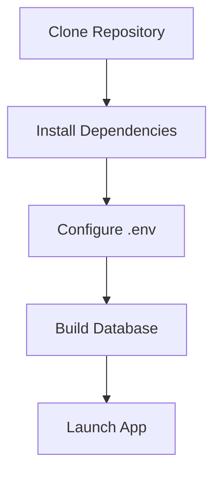

# 02 - Terminology and Setup

This page explains the technical terms used in the project and how to get everything running on your computer.

## Key Terms

*   **RAG (Retrieval-Augmented Generation)**: Using external data to help an AI give better answers.
*   **Embeddings**: Converting text into numbers so the computer can find similar meanings.
*   **Vector Database (ChromaDB)**: A special database that stores these numbers for fast searching.
*   **LLM (Large Language Model)**: The "brain" of the project (e.g., Qwen-3) that generates the text.
*   **Golden Dataset**: A list of perfect "question and answer" pairs we use to test the AI.
*   **LangSmith**: A tool we use to track exactly what the AI is thinking and doing for every request.

## Environment Setup



1.  **Clone the project**:
    ```bash
    git clone <repository-url>
    ```

2.  **Create a Virtual Environment**:
    ```bash
    python -m venv venv
    source venv/bin/activate  # On Windows use: venv\Scripts\activate
    ```

3.  **Install Dependencies**:
    ```bash
    pip install -r requirements.txt
    ```

4.  **Configuration (.env)**:
    Create a `.env` file in the root directory and add your API keys:
    ```env
    GROQ_API_KEY=your_key_here
    LANGCHAIN_API_KEY=your_key_here
    LANGCHAIN_TRACING_V2=true
    LANGCHAIN_PROJECT="anime-recommender-eval"
    ```

5.  **Build the Database**:
    Run the data loader to process the anime CSV and create the vector store:
    ```bash
    python src/data_loader.py
    ```
