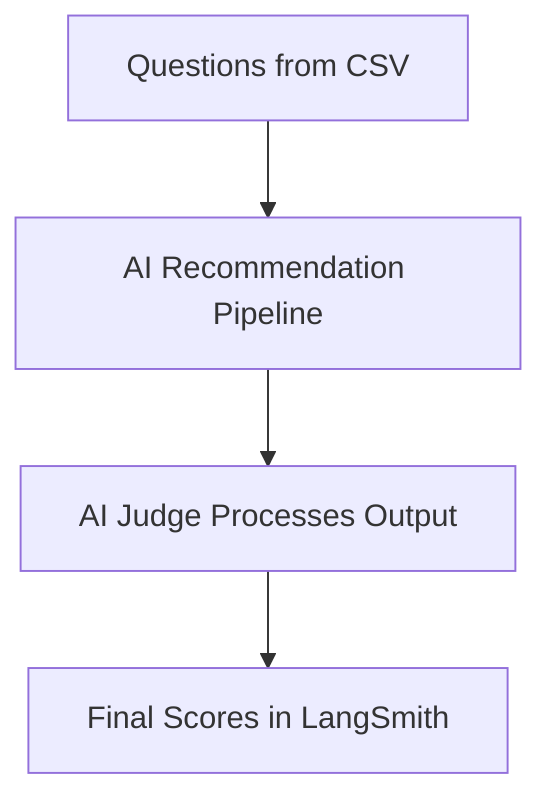

# 03 - Evaluation Framework

This page explains how we measure if our AI is doing a good job. We don't just guess; we use math and "LLM-as-a-Judge" to grade every answer.

## The Evaluation Loop



1.  **Run Tests**: We send a set of questions to the AI.
2.  **Judge Quality**: A separate AI "Judge" looks at the answer and the correct facts.
3.  **Score**: The judge gives a score from 0 to 1 based on specific criteria.

## Key Metrics
We focus on two main scores:

| Metric | Simple Meaning |
| :--- | :--- |
| **Relevance** | Does the answer actually help the user? Does it match what they asked for? |
| **Faithfulness** | Is the answer true? Did the AI stick to the provided facts without hallucinating (lying)? |

## The Golden Dataset
The "Golden Dataset" is a CSV file (`data/evaluation_test_cases.csv`) that contains the "perfect" answers. It has three parts:
*   **Input**: The user's question.
*   **Context**: The raw facts about the anime.
*   **Expected Output**: The ideal recommendation.

## How to Run Evaluation
To start the benchmarking process and see the scores in LangSmith, run:
```bash
python src/evaluation.py
```
After the script finishes, it will give you a link to a dashboard where you can see the scores for every single question.
