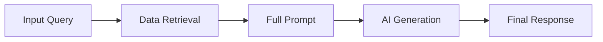

# 04 - Observability and Tracing

Sometimes the AI gives a bad answer, and we need to know **why**. We use **LangSmith** to look inside the AI's process.

## What is a "Trace"?
A Trace is like a recording of everything that happened during a single request.

It shows:
1.  **Exactly what the user asked.**
2.  **Which anime descriptions were found** in the database.
3.  **The specific instructions** (prompt) given to the AI.
4.  **How long it took** and how much it cost.

## How we use it for Debugging
When something goes wrong, we check the trace:
*   **Bad Matches?**: If the AI didn't find the right anime, our search system (the "Retriever") might need adjustment.
*   **Hallucinations?**: If the AI found the right info but gave a wrong answer, we might need to change the instructions (the "Prompt").

## Viewing Traces
Once LangSmith is enabled in your `.env`, every request made through the app or evaluation script is automatically uploaded. You can view these traces at:
[https://smith.langchain.com/](https://smith.langchain.com/)

Select your project name (e.g., `anime-recommender-eval`) to see the list of all recent interactions.
