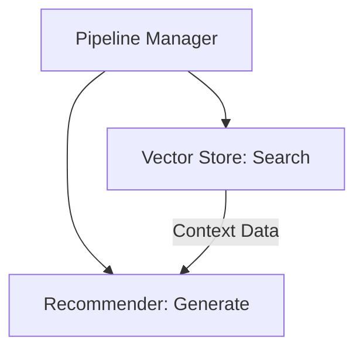

# 05 - Advanced Logic and Reliability

This page explains how we keep the system stable and reliable as it grows.

## Decoupled Design
We separate the "searching" and "answering" parts of the code.

This means:
*   **Easy Fixes**: If the search system fails, we can fix it without touching the AI instructions.
*   **Model Swapping**: We can change which AI we use (e.g., from Qwen to GPT) by updating just one file (`src/recommender.py`).

## Reliability Optimization
To make sure the AI is always helpful, we use a "Check and Correct" strategy:
1.  **Strict Context**: The AI is told to *only* use the information we provided from the database.
2.  **Explicit Formatting**: We use strict prompt templates to ensure the output is always in a format that the user (or the evaluation script) can read easily.

## Guardrail System
Guardrails are "safety checks" that prevent the AI from doing things it shouldn't:
*   **Context Grounding**: Prevents the AI from recommending an anime that isn't in our database (prevents hallucinations).
*   **Relevance Filtering**: If a user asks something unrelated to anime, the AI is trained to politely decline instead of making up a fake anime.

By separating these steps, we ensure that each part of our pipeline does exactly one job very well.
