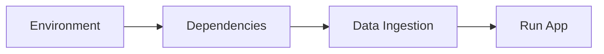

# 06 - Deployment and Commands

A quick reference for the most common commands you'll need to run this project.

## Development Commands

| Task | Command |
| :--- | :--- |
| **Start Streamlit App** | `streamlit run app/app.py` |
| **Run Evaluation** | `python src/evaluation.py` |
| **Update Database** | `python src/data_loader.py` |
| **Run Unit Tests** | `pytest tests/` |

## Environment and Data
*   **Vector Database Store**: Located in `chroma_db/`. You can delete this folder and re-run `data_loader.py` to reset the database.
*   **Logs**: Check `logs/` for detailed execution logs if the application crashes.
*   **Test Cases**: Edit `data/evaluation_test_cases.csv` to add new "Golden" examples for benchmarking.

## Setup Recap

1.  Add API keys to `.env`.
2.  Install requirements: `pip install -r requirements.txt`.
3.  Ingest data: `python src/data_loader.py`.
4.  Launch app: `streamlit run app/app.py`.
