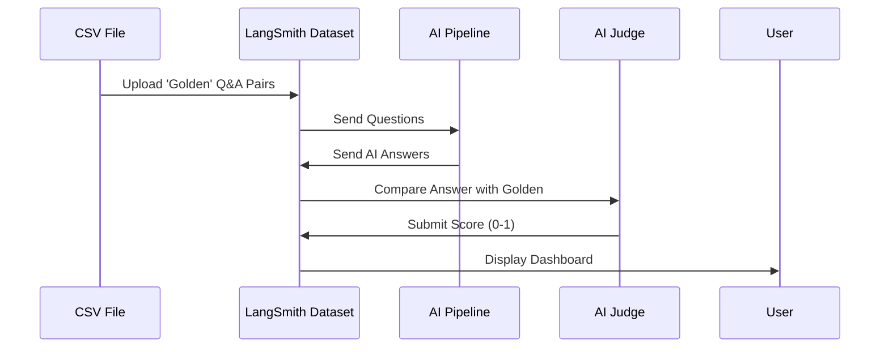

# 07 - LangSmith Evaluation Process

This document explains exactly how LangSmith helps us test the quality of our AI recommendations.

## The Evaluation Workflow
LangSmith acts as the bridge between our raw data and our quality scores. The process follows these steps:

## Detailed Process

### 1. Dataset Creation
The evaluation script (`src/evaluation.py`) reads your `data/evaluation_test_cases.csv`. If the dataset doesn't exist in LangSmith, it automatically:
*   Creates a new **Dataset** named "Anime Golden Dataset".
*   Uploads every row as an **Example** (Question + Ground Truth).

### 2. The Evaluation Run
When you run the script, LangSmith triggers an **Experiment**:
1.  **Prediction**: Our AI pipeline generates a recommendation for every question in the dataset.
2.  **Grading**: LangSmith calls our `llm_relevance_evaluator`. This is an "AI Judge" that looks at our AI's answer and compares it to the "Expected Output" from your CSV.

### 3. Scoring (LLM-as-a-Judge)
The Judge looks for two specific things:
*   **Relevance**: Did the AI actually answer the user's specific request?
*   **Faithfulness**: Did the AI stay "grounded" in the provided facts, or did it make things up?

### 4. Analysis in the UI
Once the run is complete, you get a URL to the LangSmith dashboard. Here you can:
*   **Compare Versions**: See if "Version 2.0" is better than "Version 1.0".
*   **Inspect Failures**: Click on a low score to see exactly why the judge was unhappy with the answer.
*   **Improve Goldens**: If the judge was wrong, you can manually correct the score, and LangSmith will learn from your feedback.

By using this process, we move from "guessing" if the AI is good to having **hard data** and clear scores.
