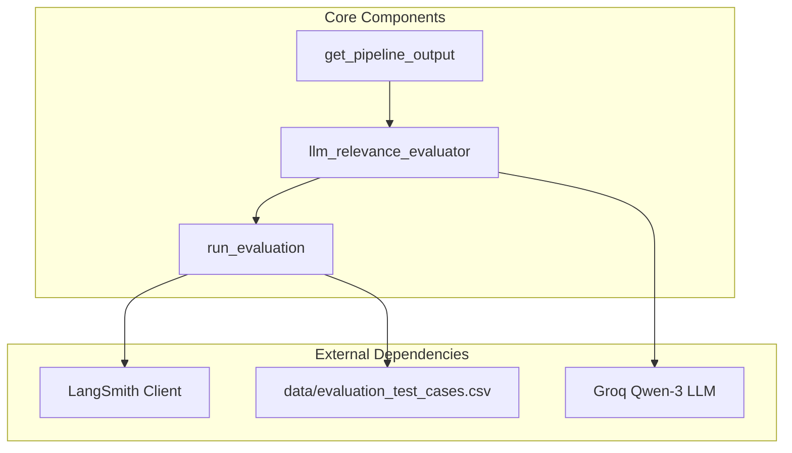
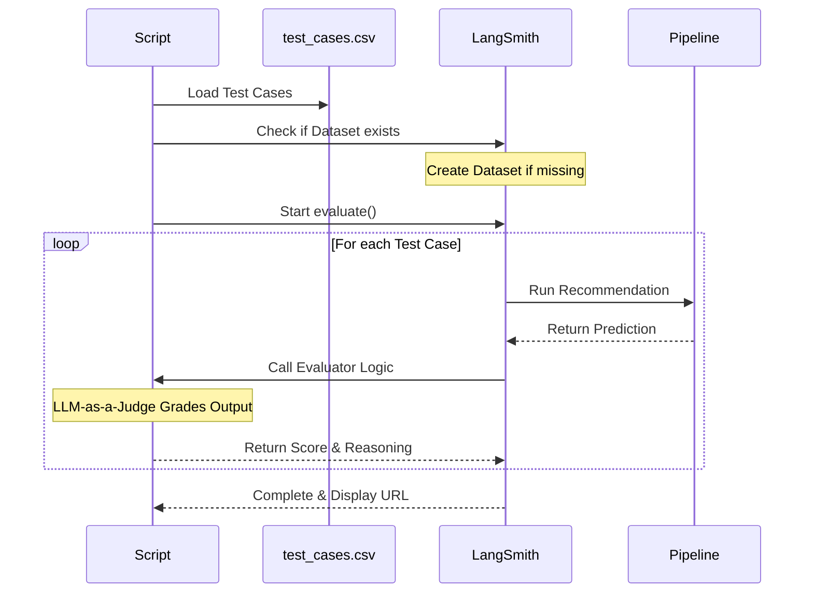
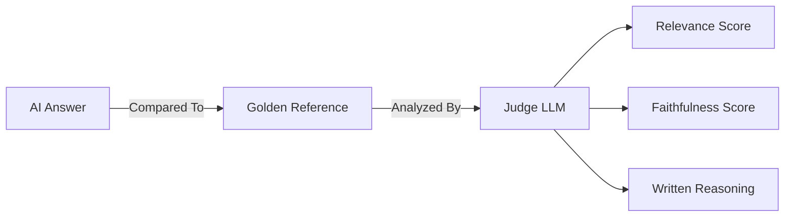

# 08 - Evaluation Script: Technical Deep Dive

This document provides a detailed technical breakdown of `src/evaluation.py`, the core script used to benchmark our anime recommendations.

## 1. Script Architecture
The evaluation script is designed to be modular, separating the pipeline execution from the grading logic.

## 2. Logic Flow
When you run `python src/evaluation.py`, the following sequence occurs:

## 3. Key Function Breakdowns

### `get_pipeline_output(inputs)`
*   **Purpose**: A standardized wrapper that LangSmith uses to trigger our pipeline.
*   **Input**: A dictionary containing the user's question.
*   **Output**: The raw recommendation string from the AI.

### `llm_relevance_evaluator(run, example)`
This is our "Judge" logic. It performs the following steps:
1.  **Extraction**: Pulls the question, AI response, and ground-truth fact from the dataset.
2.  **Judging**: Sends a structured prompt to a secondary LLM (the Judge).
3.  **Metrics**: Asks the judge to score **Relevance** and **Faithfulness** (0.0 to 1.0).
4.  **JSON Processing**: Parses the judge's response to extract scores and reasoning.

### `run_evaluation()`
*   **Orchestration**: Manages the connection to LangSmith.
*   **Dataset Management**: Ensures that the "Anime Golden Dataset" is always up-to-date with your CSV file.
*   **Execution**: Triggers the parallel execution of all test cases.

## 4. How to Read Results
After running the script, focus on the **Metadata** and **Reasoning** fields in LangSmith. If a score is low, the reasoning field will tell you exactly why the judge thought the recommendation was irrelevant or unfaithful to the facts.
