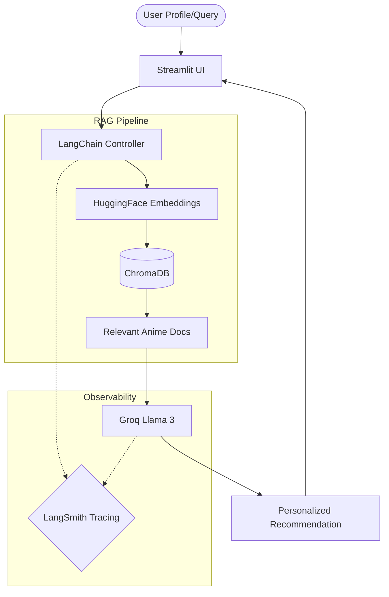
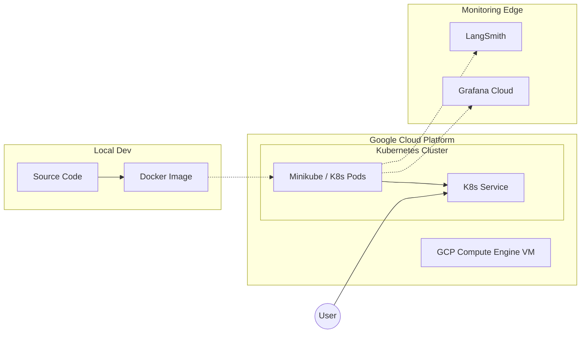
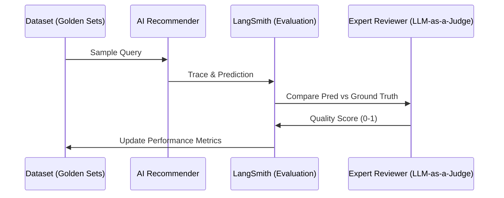

# 🎬 AI-Powered Anime Movie Recommender
### *Evaluation & Observability at Scale*

Welcome to the **AI-Powered Anime Movie Recommender**! This isn't just another recommendation engine; it’s a full-stack LLM application built with a focus on **reliability**, **observability**, and **scientific evaluation**.

---

## 🚀 The Vision
Finding the next anime to binge shouldn't feel like a chore. Our system leverages Retrieval-Augmented Generation (RAG) to understand your preferences deeply and suggest titles from a curated database, while ensuring every recommendation is backed by data and tracked for quality.

---

## 🛠️ Tech Stack

Built with the modern AI engineer's toolkit:

| Category | Technology Used |
| :--- | :--- |
| **Brain (LLM)** | [Groq (Llama 3)](https://groq.com/) |
| **Orchestration** | [LangChain](https://www.langchain.com/) |
| **Memory (Vector DB)** | [ChromaDB](https://www.trychroma.com/) |
| **Visuals (Frontend)** | [Streamlit](https://streamlit.io/) |
| **Observability** | [LangSmith](https://www.langchain.com/langsmith) |
| **Infrastructure** | **Docker** & **Kubernetes (Minikube)** |
| **Cloud Platform** | **Google Cloud Platform (GCP)** |
| **Cloud Monitoring** | **Grafana Cloud** |

---

## 📂 Code Structure

Our repository is organized into distinct modules for frontend, pipeline, and core logic:

```bash
Anime_Evals-main/
├── app/                    # 🎨 Streamlit Web Application
│   ├── app.py              # Main dashboard script
│   └── app2.py             # Advanced UI components
├── pipeline/               # ⚡ RAG Pipeline Orchestration
│   ├── build_pipeline.py   # Factory for building LLM chains
│   └── pipeline.py         # Main execution logic
├── src/                    # 🧠 Core Intelligence
│   ├── recommender.py     # Main recommendation engine
│   ├── evaluation.py      # LLM-as-a-Judge logic
│   ├── vector_store.py    # ChromaDB integration
│   └── prompt_template.py # Master prompt repository
├── DOCS/                   # 📚 In-depth Documentation
├── data/                   # 📊 Raw Anime Datasets
├── chroma_db/              # 🗄️ Local Vector Storage
├── Dockefile               # 🐋 Container specification
└── llmops-k8s.yaml        # ☸️ Kubernetes deployment
```

---

## 📐 System Architecture

Our RAG-based architecture ensures that recommendations are grounded in actual anime data, preventing "hallucinations" and providing relevant context.



---

## 🏗️ Deployment & Infrastructure

We follow a professional **Development to Production** workflow, moving from local environments to a robust cloud infrastructure on GCP.

### 🏠 Local Development
Running locally is straightforward:
1.  **Environment**: Python 3.10+
2.  **Run**: `streamlit run app/main.py`
3.  **Docker**: `docker build -t anime-recommender .`

### ☁️ Cloud Production (GCP + K8s)
Our production environment is hosted on **Google Cloud Platform** using a containerized approach managed by **Kubernetes**.



-   **Orchestration**: We use **Minikube** inside a GCP VM to manage our Kubernetes pods, ensuring high availability and scalability.
-   **Security**: API keys and tokens are managed via **Kubernetes Secrets**.
-   **Observability**: Real-time cluster metrics are streamed to **Grafana Cloud** for deep infrastructure monitoring.

---

## 🧪 Evaluation Workflow

We believe in **"What gets measured, gets improved."** Our evaluation pipeline runs systematically to ensure the AI's logic remains sharp.



---

## 🔍 Why LangSmith? (The "Magic" Mirror)

Building with LLMs can often feel like working inside a dark room. You send a prompt, and a response comes back—but *why*? 

**LangSmith** is our high-powered flashlight. We use it for:
1.  **Debugging the Black Box**: See every step of the chain, from the raw prompt to the retrieved documents.
2.  **Performance Metrics**: Track latency, token usage, and cost in real-time.
3.  **Regression Testing**: When we change a prompt, LangSmith tells us immediately if the quality dropped or improved.
4.  **Dataset Management**: Turn problematic user queries into test cases with a single click.

*Without observability, you're just guessing. With LangSmith, you're engineering.*

---

## 📚 Deep Dive Documentation

Hungry for more? We have extensive documentation covering every aspect of this project.

> [!TIP]
> 📖 You'll find in-depth docs here: [DOCS/](file:///D:\AIML\Practice\AI-anime-movie-recommender-with-Evaluation-main\DOCS)

### Navigation Guide:
- 🏗️ **[Architecture Overview](DOCS/01_introduction_and_architecture.md)**: How the gears turn.
- 🧪 **[Evaluation Framework](DOCS/03_evaluation_framework.md)**: How we measure quality.
- 📡 **[Observability Details](DOCS/04_observability_and_tracing.md)**: Deep dive into LangSmith integration.
- ☁️ **[Deployment Guide](DOCS/09-CLOUD DEPLOYMENTT.md)**: Full walkthrough for GCP, Docker, and K8s.

---
*Made with ❤️ for the Anime Community.*
